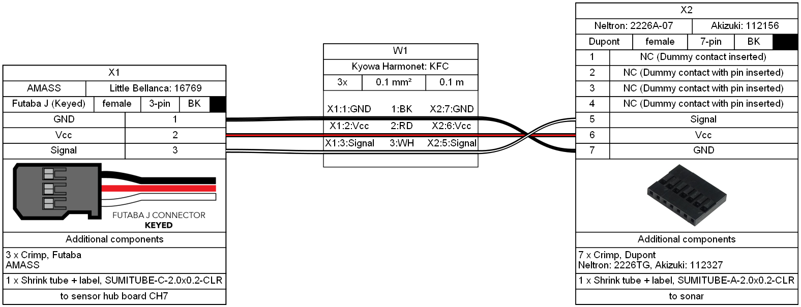
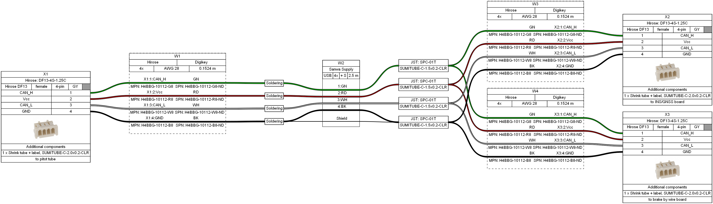
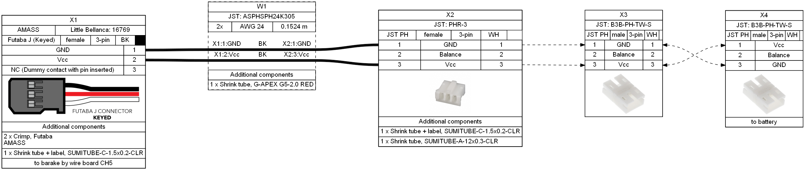

# F-03T Wiring
## Sensor Hub
### Control Wheel (1 pcs)

### Cadence (1 pcs)

### Sonar (1 pcs)

## CAN
### Top (1 pcs)

### Bottom (1 pcs)

### Interconnect (2 pcs)

## Brake by wire
### Battery (1 pcs)

### Interface (1 pcs)

